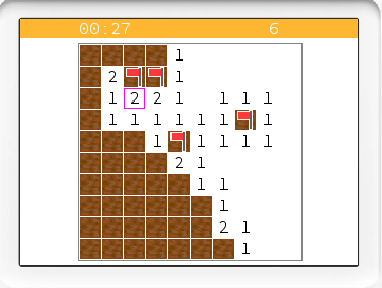
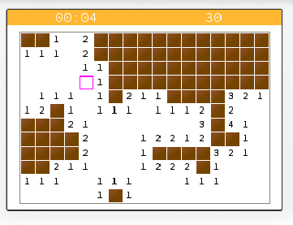
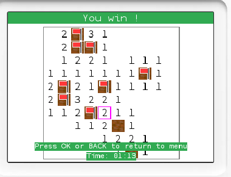
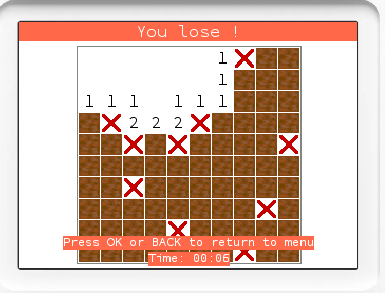

<h1 align="center">
    
     
    Minesweeper-Nw
    
    
</h1>

---

Minesweeper-Nw (Minesweeper for Numworks) is a classic minesweeper game for the Numworks calculator.

It takes the form of an external application that must be injected into the calculator, making it available in the applications list alongside the default ones.

  
  &nbsp;&nbsp;&nbsp;&nbsp;
  

  
  &nbsp;&nbsp;&nbsp;&nbsp;
  

## Controls

- Use the directional arrows to move the cursor on the grid.
- Press the "OK" key to reveal a cell.
- Press the "Back" key to flag/unflag a cell as a mine.
- The rest of the controls will be indicated on the screen at the appropriate time (menus).

## Installation

1. Download the `minesweeper_nw.nwa` file from the "Releases" section of this GitHub repository.

2. Connect your Numworks calculator to your computer using a USB data cable (official or compatible cable).

3. Open a Chromium-based web browser (Google Chrome, Microsoft Edge, Brave, etc.) on your computer or mobile device (yes, it works on mobile too!).

4. Go to the official Numworks injection page: [https://my.numworks.com/apps](https://my.numworks.com/apps).

5. Log in to your Numworks account (or create one if you don't have it).

6. Click the "Connect" button and select your calculator.
> [!NOTE]
> If it is not detected and is properly turned on, turn it off and on again until it works. It may take a few tries.

7. Once connected, click on "Select a NWA file or drop it here" and select the `minesweeper_nw.nwa` file you downloaded.

8. Click on "Install" and wait for the installation to finish (Do not disconnect the calculator during the installation).

9. The **Minesweeper** app should now be visible at the very bottom of the application list (after the basic apps) on your calculator.

## Why this project?

Because an external application in machine code is much more performant than a Python script,
and much better looking thanks to the ability to use images.

Also, this project is primarily developed for fun, and to improve my Rust skills.

## Contributing

Contributions are welcome!

> The `main` branch is used for development. For stable versions, refer to the "Releases" section of this GitHub repository.

To contribute, use the provided Docker environment and the `justfile` which do all the setup work for you (develop in the container via **Dev Containers** on VS Code).

## License

This project is licensed under the [GPL-3.0 License](./LICENSE) (GNU General Public License version 3).

## Legal Information

This project is in no way affiliated with Numworks or their partners.

