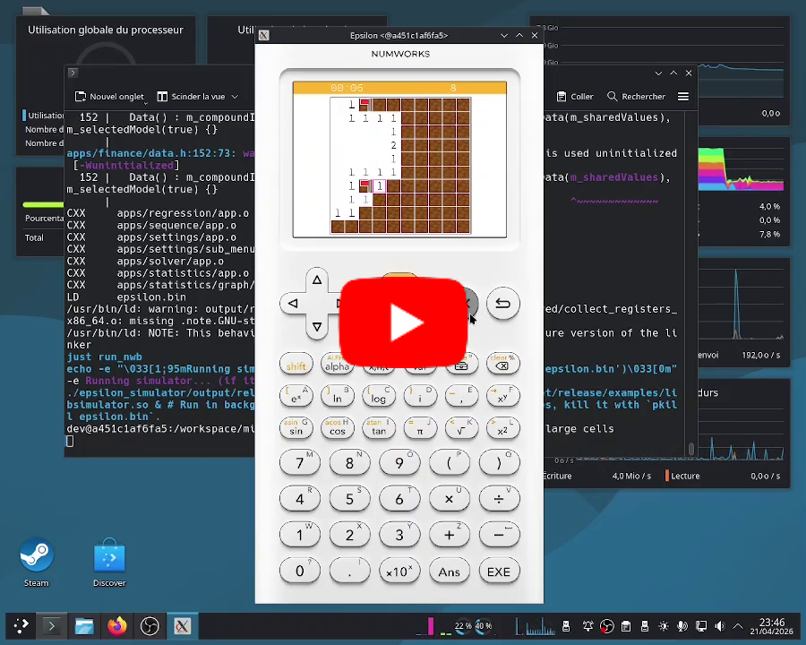

<h1 align="center">
    
     
    Minesweeper-Nw
     
    
    
</h1>

---

Minesweeper-Nw (Minesweeper for Numworks) is a classic minesweeper game for the Numworks calculator.

It takes the form of an external application that must be injected into the calculator, making it available in the applications list alongside the default ones.

<table width="100%">
  <tr>
    <td width="25%" align="center"></td>
    <td width="25%" align="center"></td>
    <td width="25%" align="center"></td>
    <td width="25%" align="center"></td>
  </tr>
</table>

## Controls

| Key                 | Action                                      |
| ------------------- | ------------------------------------------- |
| `OK`                | Reveal a cell                               |
| `Back`              | Place a flag                                |
| Arrow keys          | Move the cursor                             |
| `Clear` (`Del`)     | Quit (saves the game if one is in progress) |
| `Paste` (`Toolbox`) | Forfeit the current game                    |

## Installation

To install the game, follow this guide: [How to install](https://nwagyu.org/guide/help/how-to-install).

## Technologies

- This project uses the [eadkp](https://github.com/Oignontom8283/eadkp) HAL !
- Developed in Rust. C or C++ would have been easier, but I prefer Rust!
- Uses the following crates: `heapless`, `serde`, `postcard`, `embedded-alloc`, and `eadkp`.
- I'm using Blockbench to create assets (okay, they're ugly, but I'm no artist).

## Why this project?

Because an external application in machine code is much more performant than a Python script,
and much better looking thanks to the ability to use images.

Also, this project is primarily developed for fun, and to improve my Rust skills.

## Contributing

Contributions are welcome!

> The `main` branch is used for development. For stable versions, refer to the "Releases" section of this GitHub repository.

To contribute, use the provided Docker environment and the `justfile` which do all the setup work for you (develop in the container via **Dev Containers** on VS Code).

## Testing locally

1. Ensure `git`, `docker`, and `xhost` are installed. If you are on Windows, perform everything within WSL.
2. Clone the repository.
3. Run `chmod +x ./docker.sh` and `./docker start` to start the docker container (recommended).
4. Wait (this might take a while).
5. Run `./docker shell` to enter the docker environment (recommended).
6. Run `just sim` (`just sim [NB_THREAD]` to specify the number of threads to use, **HIGHLY RECOMMENDED**).
7. Wait (this might take a while).
8. A window representing the Numworks calculator should open.

Compilation and demo video :

## License

This project is licensed under the [GPL-3.0 License](./LICENSE) (GNU General Public License version 3).

## Legal Information

This project is in no way affiliated with Numworks or their partners.

